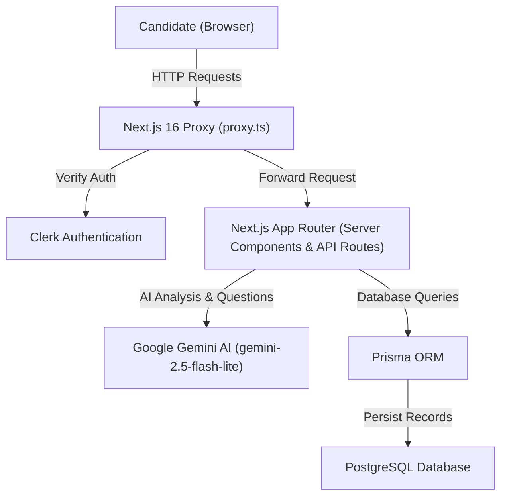

# InterviewAI — Technical Roadmap & Implementation Tracker

Welcome to the engineering documentation and implementation tracking index for **InterviewAI**. Each phase of the project is documented in its own dedicated file with feature breakdowns, architectural diagrams, file references, and live completion statuses.

---

## 🧭 Master Phase Index

| Phase       | Focus Area                                          | Status         | Document Link                                                            |
| ----------- | --------------------------------------------------- | -------------- | ------------------------------------------------------------------------ |
| **Phase 1** | **Foundations, Auth & Data Persistence**            | `✅ COMPLETED` | [Phase 1 Documentation](./PHASE_1_FOUNDATIONS_AND_PERSISTENCE.md)        |
| **Phase 2** | **Mock Interview Room, STT & STAR Evaluation**      | `✅ COMPLETED` | [Phase 2 Documentation](./PHASE_2_MOCK_INTERVIEW_ROOM_AND_STT.md)        |
| **Phase 3** | **Voice Synthesis (TTS) & Multimodal Coding**       | `⏳ UPCOMING`  | [Phase 3 Documentation](./PHASE_3_VOICE_AND_MULTIMODAL.md)               |
| **Phase 4** | **Production Hardening, Rate Limiting & Analytics** | `📅 PLANNED`   | [Phase 4 Documentation](./PHASE_4_PRODUCTION_HARDENING_AND_ANALYTICS.md) |

---

## 🏗️ Architecture Overview



---

## 📁 Key File Structure

```text
interview-ai/
├── app/
│   ├── api/
│   │   ├── evaluate-answer/        # STAR method answer evaluation
│   │   ├── generate-questions/     # Tailored question generator
│   │   ├── interview-session/      # Session retrieval API
│   │   └── parse-resume/           # PDF parser and skill extractor
│   ├── components/
│   │   ├── AnswerBox.tsx           # Voice STT & Text answer input
│   │   ├── Navbar.tsx              # Active route navigation header
│   │   ├── QuestionCard.tsx        # Question preview card
│   │   ├── QuestionGenerator.tsx   # Customization controls
│   │   ├── ResumeResult.tsx        # Structured profile viewer
│   │   └── UploadBox.tsx           # Drag-and-drop resume uploader
│   ├── dashboard/page.tsx          # Metrics, recent sessions & resumes
│   ├── hooks/
│   │   └── useSpeechToText.ts      # Web Speech API STT voice hook
│   ├── interview/page.tsx          # Turn-by-turn mock interview room
│   ├── lib/
│   │   ├── gemini.ts               # Shared Google Gemini singleton
│   │   ├── parser.ts               # PDF text extraction
│   │   └── prisma.ts               # Prisma client & ensureUser sync
│   ├── upload/page.tsx             # Resume upload flow
│   ├── layout.tsx                  # Root layout & ClerkProvider
│   └── page.tsx                    # SaaS landing page
├── docs/                           # Implementation & Roadmap Docs
├── prisma/
│   └── schema.prisma               # PostgreSQL relational schema
└── proxy.ts                        # Next.js 16 route proxy middleware
```
